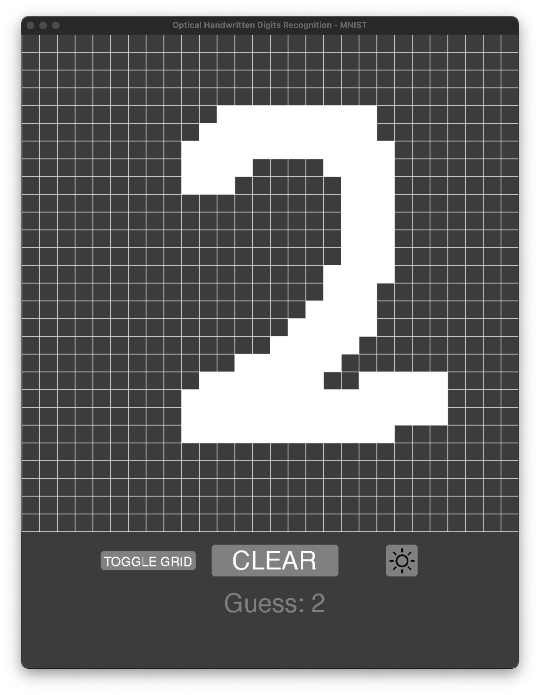

# Optical Handwritten Digits Recognition
> Drawing program to detect which base 10 digits (0-9) are being drawn using a neural network model trained with TensorFlow.

## Table of Contents
* [General Info](#general-information)
* [Technologies Used](#technologies-used)
* [Features](#features)
* [Screenshots](#screenshots)
* [Setup](#setup)
* [Usage](#usage)
* [Project Status](#project-status)
* [Room for Improvement](#room-for-improvement)
* [Contact](#contact)
<!-- * [License](#license) -->


## General Information
A Pygame drawing program to detect which base 10 digits (0-9) are being drawn
using a neural network model trained with TensorFlow.

Originally a class project for my AI class, I further worked on it after to make the program faster and the classifier more accurate. I originally was using a KNN classifier with k=3 (thoroughly tested several k values to find the best one), but the problem with this was that the classification accuracy was constant and could not improve over time. Additionally, using a KNN approach proved to be very laggy and slow since the algorithm worked by comparing the image to all other training images. Another thing with the original project was that I was using the MNIST dataset, which is a truncated version of the NIST dataset which contains all English letters and digits (0-9) whiile the MNIST only contains the digits. In addition, the MNIST dataset used images of size 28x28 pixels while the NIST dataset uses imags of size 128x128 pixels.

The new version of the program works by using a sequantial neural network model that was trained using TensorFlow. In this version of the project I allowed the user to be able to either use the MNIST images or the NIST images. THere is a separete model trained for both. The MNIST model was trained using 70,000 images while the NIST model was trained using over 400,000 images. Considering this, the NIST model takes more time to train than the MNIST model. Thus, the MNIST model was trained more with more variations. In the end, the MNIST model accuracy is over 99%, while the NIST model accuracy is around 95%.


## Technologies Used
- TensorFlow - version 2.9.2
- Keras - version 2.9.0
- Pygame - version 2.1.2
- Numpy - version 1.23.1


## Features
- Unique boat mechanics that model a real boat going down a river.
- Global leaderboard with the use of a web-hosted relational database.
- Login/signup system to be able to save users' data.
- Ability to draw smoothly while displaying live guesses.
- Interactive UI with buttons to toggle grid lines, clear board and change dark/light mode.
- Adapt to 28x28 image or 128x128 image.


## Screenshots
<p align="center">
  
  
</p>
<p align="center">
  
  
</p>
<p align="center">
  
</p>


## Setup
Run generate_nist_train_images.py to generate the nist data train images. This file is over 2GB, meaning it could not be uploaded to GitHub.


## Usage
Run main.py from the terminal. Use a single command-line arguments to specify the dataset ('mnist' or 'nist').

```console
$ python3 main.py nist
```

```console
$ python3 main.py mnist
```

## Project Status
Project is: _in progress_


## Room for Improvement
Room for improvement:
- Train the NIST model more to improve classification accuracy.

To do:
- Make it possible to draw on a grid size of any number of pixels by efficiently scaling down the image to 28x28 or 128x128 to be able to use TF model on it.


## Contact
- Created by @FirdavsN
- email: fnasridd@caltech.edu
